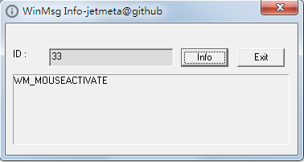

# WinMsgInfo - Windows Message Info 
- trivial demo : retrieve windows message name from message id

## usage
- show windows message name from id.

## download

[Release](https://github.com/JetDemo/WinMsgInfo/tree/master/bin "Release")

## changelog

### [0.00.01] - 14-05-21
#### vs2015
- add vs2015 prj

### [0.00.01] - 14-05-21
#### init
- usage : show windows message name from id.
